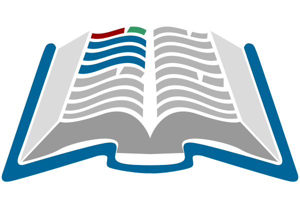

# OpenClass: Herramientas Abiertas e IA para Docentes

<header>

</header>

## 🎯 Descripción
**OpenClass** es un curso diseñado para **docentes, capacitadores y personas que quieran compartir conocimiento**, entregando competencias prácticas en herramientas abiertas y de inteligencia artificial.  
El objetivo es que cada participante pueda **crear, publicar y difundir** materiales educativos o de divulgación de manera sencilla, reproducible y colaborativa.  

## 🗂️ Contenido del curso

| Módulo | Título | Contenido |
|--------|--------|-----------|
| **0** | Ecosistema de Herramientas Abiertas + IA | - Introducción general al curso. - Mapa de herramientas: Google Workspace, GitHub, Quarto, LaTeX, Streamlit, ChatGPT. |
| **1** | Ofimática Colaborativa (Google Workspace) | - Google Docs, Sheets y Slides. - Trabajo en equipo y gestión de recursos en la nube. |
| **2** | ChatGPT en la Docencia | - Creación de materiales y actividades. - Generación de evaluaciones y rúbricas. - Escritura asistida y uso ético de la IA. |
| **3** | Primeros pasos en la nube (Colab / RStudio Cloud) | - Notebooks colaborativos en Python y R. - Ejemplos con datos educativos. |
| **4** | Programación básica aplicada a la docencia | - Python/R para análisis de notas, encuestas y gráficos sencillos. |
| **5** | Git y GitHub como aula virtual expandida | - Crear repositorios de clase. - Publicar y organizar materiales abiertos. |
| **6** | Redacción académica con LaTeX (Overleaf + local) | - Documentos académicos y guías docentes. - Bibliografía, figuras y plantillas. |
| **7** | Documentación y Presentaciones con Quarto | - Reportes reproducibles. - Publicación de presentaciones y sitios web de curso. |
| **8** | Aplicaciones Interactivas (Streamlit / Shiny) | - Creación de apps sencillas para enseñanza y divulgación. |
| **9** | Data Storytelling | - Principios de narrativa visual. - Presentaciones impactantes con datos. |
| **10** | Difusión y Licencias Abiertas (Optativo) | - Creative Commons. - Publicación en Zenodo / OSF / GitHub Pages. |

## 🌟 Proyecto Final
Cada participante entrega un **Kit Docente Reproducible**, que incluye:  
- Carpeta en Google Drive (Docs, Sheets, Slides).  
- Documento de prompts aplicados a su asignatura.  
- Documento en LaTeX o Quarto.  
- Repositorio en GitHub con materiales de curso.  
- Mini app en Streamlit o Shiny.  

## 👥 Público objetivo
- Docentes que desean modernizar sus clases.  
- Capacitadores o talleristas que quieran estructurar y compartir recursos.  
- Investigadores y divulgadores que busquen publicar material de manera abierta.  

## 🛠️ Herramientas principales
- **Google Workspace**: Docs, Sheets, Slides, Colab.  
- **GitHub**: repositorios de curso y materiales.  
- **Quarto & LaTeX (Overleaf / TeX Live)**: reportes, guías y artículos académicos.  
- **Streamlit / Shiny**: apps interactivas.  
- **ChatGPT**: generación de materiales, ejercicios y escritura asistida.  

